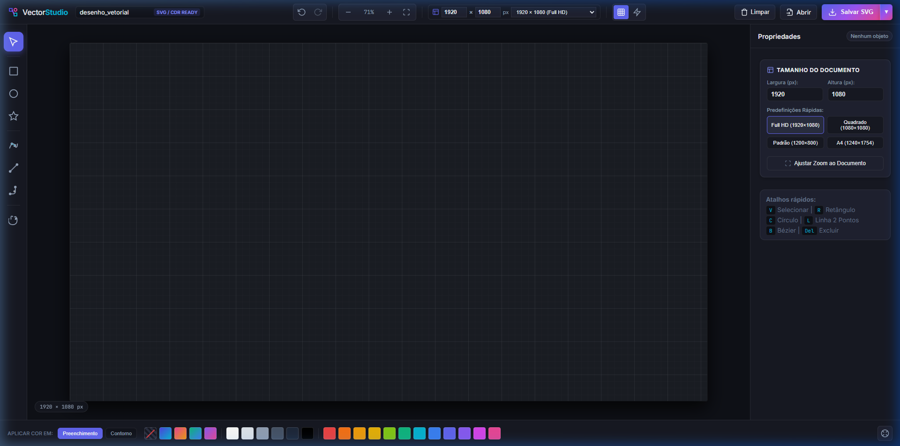
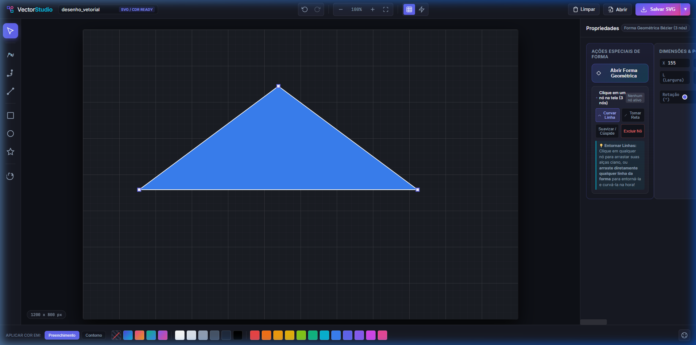
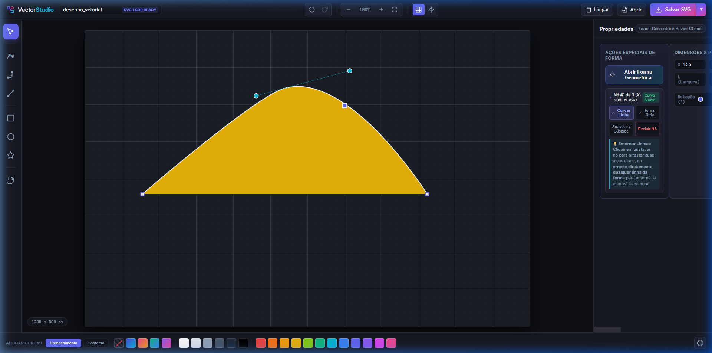
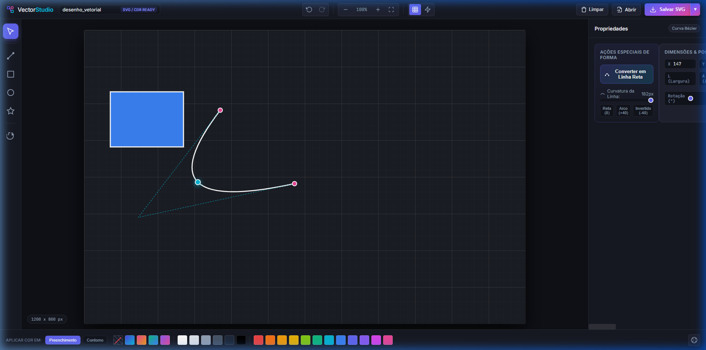
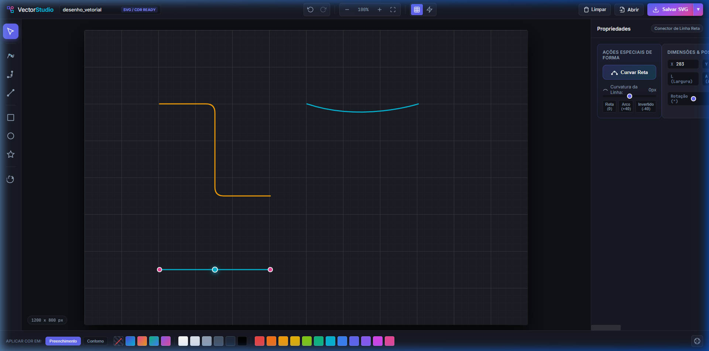
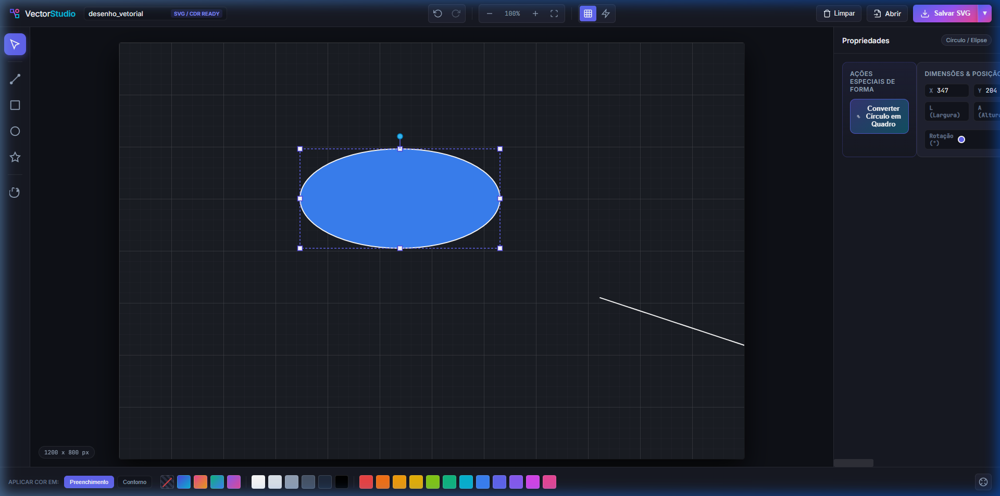
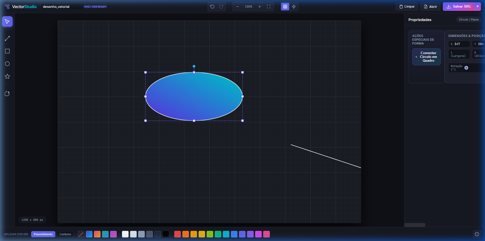

# Vector Studio 🎨
> **Editor Vetorial Web & Exportador SVG / CDR-Ready**  
> Desenvolvido em HTML5, CSS3 e JavaScript puro, rodando 100% localmente no navegador, sem dependências externas.

---

## 📸 Visão Geral da Interface



---

## 🚀 Funcionalidades Principais

### 1. 📐 Barra de Ferramentas Reorganizada (De Cima para Baixo)
A barra lateral esquerda conta com fluxo ergonômico organizado de cima para baixo:
- **Seleção (`V`)**: Seleciona, translada, redimensiona e rotaciona objetos vetoriais.
- **Retângulo / Quadro (`R`)**: Criação de quadros com controle de raio de cantos.
- **Círculo / Elipse (`C`)**: Desenho de círculos e elipses perfeitas.
- **Polígono / Estrela (`P`)**: Criação de polígonos regulares e estrelas com ajuste dinâmico de pontas.
- **Bézier (`B`)**: Desenho de linhas livres, curvas paramétricas e formas poligonais fechadas.
- **Conector de Linha Reta (`L`)**: Reta de 2 pontos com curvatura ajustável.
- **Conector Redondo de Ângulo Reto (`X`)**: Conector com cotovelo de 90° e raio suavizado.
- **Mover Tela / Pan (`Espaço` / `H`)**: Navegação fluida pelo documento.

---

### 2. 📏 Dimensões do Documento Customizáveis em Pixels (`px`)
Configure o tamanho do documento a qualquer momento:
- **Barra Superior**: Inputs diretos de **Largura (px)** e **Altura (px)** com atualização em tempo real.
- **Predefinições Rápidas**:
  - `1920 × 1080` (Full HD)
  - `1080 × 1080` (Quadrado para Instagram / Redes Sociais)
  - `1200 × 800` (Tamanho Padrão do Estúdio)
  - `800 × 600` (Clássico)
  - `1240 × 1754` (A4 Retrato - 150 DPI)
  - `1754 × 1240` (A4 Paisagem - 150 DPI)
- **Painel Lateral (Propriedades)**: Quando nada estiver selecionado, exibe os campos de dimensões, predefinições em grade e o botão **"Ajustar Zoom ao Documento"**.
- **Indicador Flutuante**: Badge interativo no canto inferior esquerdo mostrando a dimensão ativa do canvas.

---

### 3. ✒️ Ferramenta Bézier Avançada & Formas Geométricas
A ferramenta Bézier foi modelada seguindo o fluxo de softwares profissionais:



- **Fechamento de Formas**: Ao reconectar a linha com o ponto inicial de origem, o caminho é transformado instantaneamente em uma **forma geométrica fechada**, permitindo preenchimento de cor sólida ou gradiente.
- **Manipulação de Nós e Curvatura**:
  - Selecione qualquer nó do traçado com a ferramenta **Seleção (`V`)**.
  - Ajuste alças tangentes (`control points`) para entornar/curvar linhas livremente.
  - **Botão "Curvar Linha"**: Converte uma aresta reta em curva suave criando alças tangentes imediatas.
  - **Botão "Tornar Reta"**: Remove as alças de curvatura, retificando o segmento.
  - **Botão "Suavizar / Cúspide"**: Alterna simetria das alças de controle.
  - **Botão "Excluir Nó"**: Remove o nó mantendo a integridade do restante do desenho.



---

### 4. 〰️ Linhas e Conectores Curváveis
- **Reta de 2 Pontos com Curvatura**:
  - Transforme qualquer reta em arco usando o slider de curvatura ou os botões de atalho rápido (*Arco +40*, *Reto*, *Invertido -40*).
  - Controle de espessura de traço, estilo de linha (sólida, tracejada, pontilhada) e pontas arredondadas.



- **Conector Redondo de Ângulo Reto**:
  - Conector de 90 graus com slider de **Raio do Ângulo** (0px a 100px) e atalhos rápidos (0px reto, 16px, 32px suave).
  - Botão **Inverter Sentido** para alternar o dobramento do cotovelo entre Horizontal-Vertical ou Vertical-Horizontal.



---

### 5. 🔄 Ações Especiais de Forma
- **Converter Quadro em Círculo / Círculo em Quadro**: Alterne formas retangulares em elipses/círculos preservando proporção, posição, cor de fundo, contorno e gradientes com um único clique.
- **Remover / Arredondar Pontas**: Slider dedicado para suavizar cantos ou remover pontas de retângulos (Border Radius de 0 a 100px).



---

### 6. 🌈 Quadro de Cores & Gradientes Dinâmicos
- **Paleta Inferior Rápida**: Cores prontas para aplicar em 1 clique.
- **Alternador Preenchimento / Contorno**: Escolha onde a cor será aplicada com facilidade.
- **Tipos de Preenchimento**:
  - **Sólido**: Seletor de cor nativo e campo de código Hexadecimal (`#HEX`).
  - **Gradiente**: Suporte a gradientes **Lineares** e **Radiais**, com controle de ângulo (0° a 360°) e paradas de cores inicial e final.
  - **Sem Preenchimento**: Transparência para sobreposição de camadas.
- **Opacidade**: Slider de transparência de 0% a 100%.



---

### 7. 💾 Exportação & Compatibilidade
  - Gera arquivo `.svg` limpo, com tags vetoriais padronizadas, gradientes declarados e compatibilidade total para abertura e edição direta em outros aplicativos do tipo.
- **Exportar PNG**: Exporta renderização de alta resolução nas dimensões exatas configuradas no documento.
- **Salvar Projeto (`.vector.json`)**: Salva todo o histórico de nós, curvas, dimensões e cores para continuidade futura.
- **Abrir / Importar**: Permite abrir tanto arquivos `.svg` externos quanto arquivos de projeto `.json`.

---

## ⌨️ Atalhos de Teclado

| Atalho | Ação |
| :--- | :--- |
| <kbd>V</kbd> | Ferramenta Seleção |
| <kbd>R</kbd> | Desenhar Retângulo / Quadro |
| <kbd>C</kbd> | Desenhar Círculo / Elipse |
| <kbd>P</kbd> | Desenhar Polígono / Estrela |
| <kbd>B</kbd> | Ferramenta Bézier |
| <kbd>L</kbd> | Conector Linha Reta (2 Pontos) |
| <kbd>X</kbd> | Conector Redondo Ângulo Reto |
| <kbd>H</kbd> ou segurar <kbd>Espaço</kbd> | Ferramenta Pan / Mover Tela |
| <kbd>Ctrl</kbd> + <kbd>Z</kbd> | Desfazer |
| <kbd>Ctrl</kbd> + <kbd>Y</kbd> / <kbd>Ctrl</kbd> + <kbd>Shift</kbd> + <kbd>Z</kbd> | Refazer |
| <kbd>Del</kbd> ou <kbd>Backspace</kbd> | Excluir objeto ou nó selecionado |
| <kbd>Ctrl</kbd> + <kbd>D</kbd> | Duplicar objeto |
| <kbd>Setas</kbd> | Mover objeto 1px (com <kbd>Shift</kbd>: 10px) |
| <kbd>Scroll do Mouse</kbd> | Zoom interativo centrado no cursor |

---

## 💻 Como Rodar Localmente

1. Não é necessário instalar nenhum servidor ou dependência (como Node.js, Python, etc.).
2. Basta clicar duas vezes no arquivo **`index.html`** ou abri-lo diretamente no seu navegador de preferência (Google Chrome, Microsoft Edge, Firefox, Brave, Safari).
3. Todo o processamento vetorial roda localmente em sua máquina com alta performance.

---

## 📁 Estrutura de Arquivos

```text
vetor/
├── index.html          # Estrutura semântica, painéis, SVG canvas e menus
├── style.css           # Design moderno, tema dark, glassmorphism e responsividade
├── app.js              # Mecânica vetorial completa, Bézier, nós, histórico e exportação
├── README.md           # Documentação completa do projeto
└── screenshots/        # Galeria de imagens demonstrativas
    ├── 01_interface_geral.png
    ├── 02_formas_fechadas_bezier.png
    ├── 03_edicao_nos_curvas.png
    ├── 04_curvar_linha_2pontos.png
    ├── 05_gradiente_e_cores.png
    ├── 06_converter_retangulo_circulo.png
    └── 07_conectores_e_ferramentas.png
```
